<!--
  Profile README for github.com/sangothayan-y
  Top block: ASCII portrait + info card + live contribution graph (self-hosted SVGs).
  Below: full profile content (stats, projects, certs, achievements, education).
-->
<div align="center">

<table>
<tr>
<td valign="top"></td>
<td valign="top"></td>
</tr>
</table>

## Sangothayan

**ICT Undergraduate · Aspiring Backend Developer · Java · Spring Boot**

[](mailto:ysangothayan@gmail.com)
[](https://www.linkedin.com/in/yoganantham-sangothayan-244068396/)
[](https://github.com/sangothayan-y)

<br>

<!-- animated contribution graph, refreshed daily by the workflow -->


</div>

<br>

[](https://github.com/sangothayan-y)

<div align="center">

[](https://git.io/typing-svg)

</div>

## 👨‍💻 About Me

```java
public class Sangothayan {
    private String name = "Sangothayan";
    private String location = "Vavuniya, Sri Lanka";
    private String degree = "BICT (Hons), University of Vavuniya";
    private String[] languages = {"Java", "C#", "C++", "Python"};
    private String[] frameworks = {"Java AWT", "Java Swing", ".NET"};
    private String[] webStack = {"HTML", "CSS", "JavaScript"};
    private String[] databases = {"MySQL"};
    private String[] currentlyLearning = {"Software Development", "Prompt Engineering", "Git & GitHub"};

    public String motto() {
        return "Learning by building, one small project at a time.";
    }

    public static void main(String[] args) {
        Sangothayan me = new Sangothayan();
        System.out.println(me.motto());
    }
}
```

## 🛠️ Tech Stack

**Languages**


**Frameworks & Libraries**


**Web Development**


**Databases**


**Tools**


## 📊 GitHub Stats

<div align="center">


</div>

## 🔥 Streak Stats

<div align="center">


</div>

## 📈 Activity Graph

<div align="center">


</div>

## 🏆 Trophy Wall

<div align="center">


</div>

## 💼 Experience

<details>
<summary><b>🌱 ZeroPlastic Club — Director of Media & Marketing</b></summary>
<br>

**University of Vavuniya** | Ongoing

- Led promotional campaigns and managed digital media presence to support environmental sustainability initiatives.
- Coordinated content and outreach strategy for club events and awareness drives.

</details>

<details>
<summary><b>📸 Unipods Lens Photography Club — Lead</b></summary>
<br>

**University of Vavuniya** | Ongoing

- Coordinated photography projects and events.
- Guided fellow members in technical and creative photography skills.

</details>

## 🚀 Featured Projects

<div align="center">

| Project | Stack | Description |
|---|---|---|
| **[Pharmacy Management System](https://github.com/sangothayan-y/pharmacy-management-system)** | Java | Console-based pharmacy system with stock management, prescription handling, and bulk discount billing. Uses interface, multi-level inheritance, and polymorphism across 6 classes. |
| **[Ride Booking System](https://github.com/sangothayan-y/ride-booking-system)** | Java | Fare estimation system supporting bike, car, and auto rides. Demonstrates abstract classes, inheritance, and polymorphism with a clean booking summary output. |
| **[Simple Chatbot GUI](https://github.com/sangothayan-y/simple-chatbot-gui)** | Python | A rule-based desktop chatbot with a dark-themed GUI. Handles keyword-based responses with randomized replies inside a scrollable chat window. |

</div>

> 🔧 *More projects coming soon as I continue learning and building.*

## 📜 Certifications

| Certificate | Issuer | Date |
|---|---|---|
| Learn Python (74 lessons, 5.6 hrs) | Scrimba | April 2026 |
| SkillUp 101 – Java | EDUCBA | March 2026 |

## 🏅 Achievements

| Achievement | Organizer | Date |
|---|---|---|
| Participant — InnovateX Hackathon (IEEE VanniXtreme 2.0, Individual Non-AI Competition) | IEEE Student Branch, University of Vavuniya | November 2025 |
| Certificate of Appreciation — USBus Mobile American Space Event | U.S. Embassy Sri Lanka | May 2026 |

## 🎓 Education

**Bachelor of Information and Communication Technology (Honours)**
University of Vavuniya, Sri Lanka — *2nd Year, 2nd Semester (4-Year Programme)*


**G.C.E. Advanced Level & Ordinary Level**
St. John's College, Jaffna

## 📚 Currently Learning

- 🤖 Software Development fundamentals
- 💬 Prompt Engineering
- 🌐 Git & GitHub workflows
- 🗄️ Database design with MySQL

## 📫 Connect With Me

<div align="center">

[](mailto:ysangothayan@gmail.com)
[](https://www.linkedin.com/in/yoganantham-sangothayan-244068396/)
[](https://github.com/sangothayan-y)


</div>


